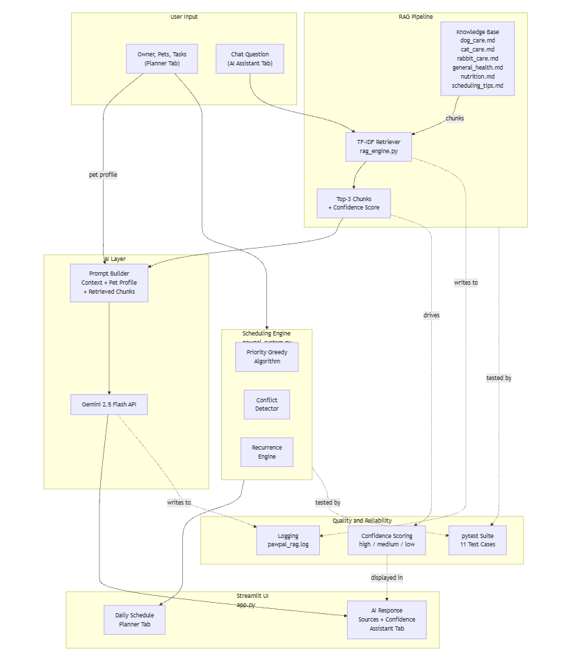
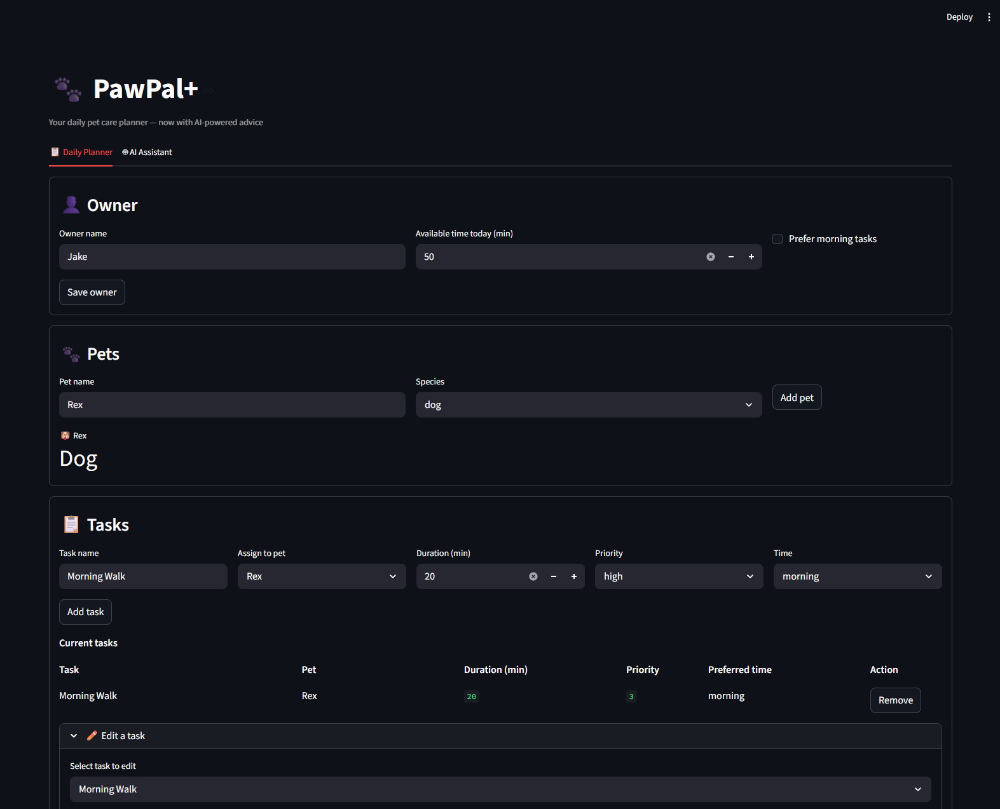
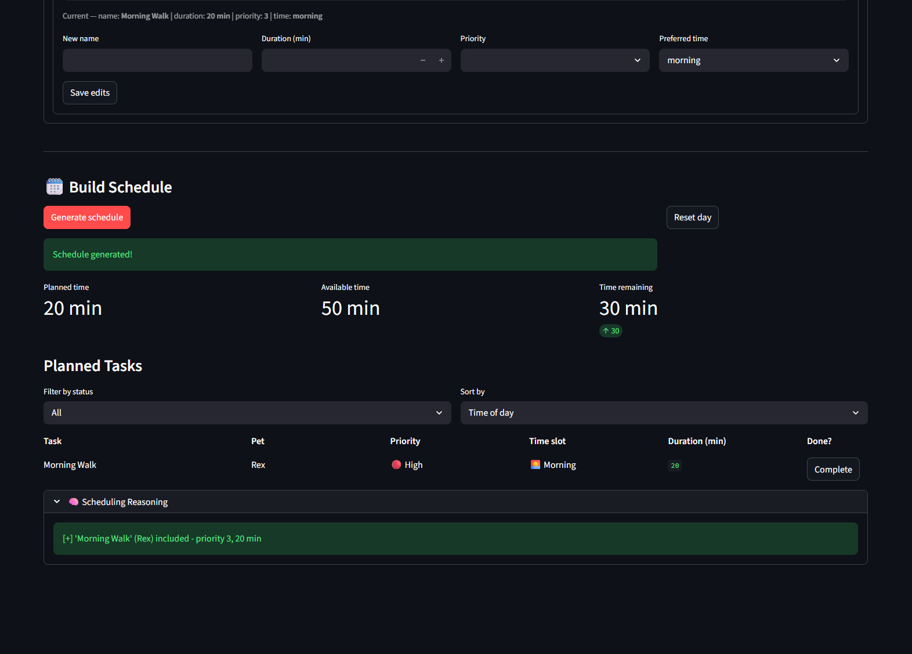
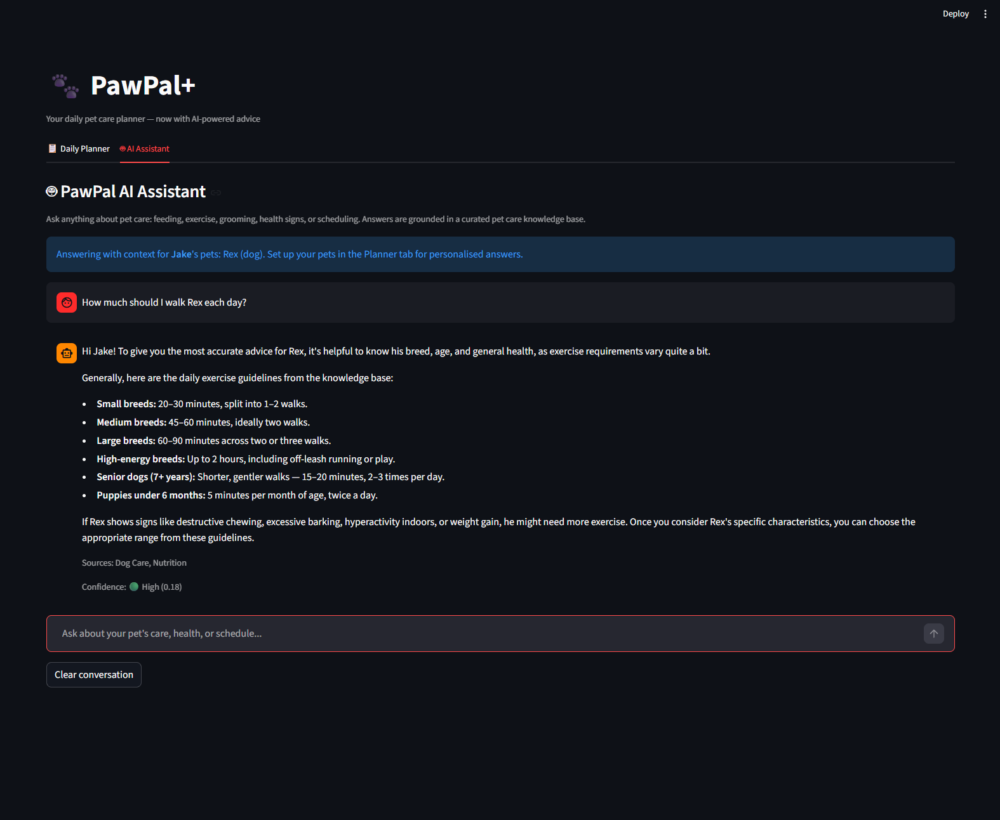

# PawPal+ AI - Pet Care Planner with RAG-Powered Assistant

## PawPal+ (Module 2 Project)

**PawPal+** was built in Modules 2 as a Streamlit application that helps busy pet owners stay consistent with daily pet care. The original system let users enter an owner profile and one or more pets, add care tasks with a priority level and duration, and then generate a daily schedule using a priority-based greedy algorithm. It included conflict detection for overlapping time slots, task recurrence for daily/weekly routines, and a scheduling reasoning log that explained every include/skip decision.

---

## Module 4 Extension: RAG-Powered AI Assistant

### What It Does and Why It Matters

PawPal+ now includes a **Retrieval-Augmented Generation (RAG) chatbot** powered by Google Gemini. Instead of answering pet care questions from memory alone, the assistant first searches a curated knowledge base of markdown files (covering dog care, cat care, rabbit care, general health, nutrition, and scheduling), retrieves the most relevant excerpts, and injects them into the prompt sent to Gemini. The result is grounded, source-cited advice that is directly connected to each user's own pet profile.

This matters because pet care advice must be accurate and species-specific, a response hallucinated by a general LLM can be harmful. RAG anchors the model to verified information, while the live session context makes answers personal rather than generic.

---

## System Architecture

### Diagram

<a href="assets/system_architecture.png" target="_blank">
  
</a>

### Architecture Overview

The system has two parallel pipelines connected through the Streamlit UI.

**Planner pipeline:** The user sets up an owner profile and pets, adds care tasks with priority and duration, and clicks "Generate Schedule." `pawpal_system.py` runs a priority-based greedy algorithm, detects time-slot conflicts, and displays the result with a reasoning log.

**AI assistant pipeline:** When the user types a question in the AI tab, `rag_engine.py` transforms the query and all knowledge-base chunks into TF-IDF vectors, computes cosine similarity, and returns the top-3 most relevant excerpts along with a confidence score. `gemini_client.py` builds a structured prompt that combines those excerpts with the user's current pet profile (from session state) and calls Gemini 2.5 Flash. The response is displayed in a chat interface with source labels and a colour-coded confidence indicator (green/yellow/red).

All retrieval and API calls are written to `pawpal_rag.log` so every system action is auditable.

---

## Setup Instructions

### 1. Clone the repository

```bash
git clone <your-repo-url>
cd applied-ai-system-project
```

### 2. Create and activate a virtual environment

```bash
python -m venv .venv
# Windows
.venv\Scripts\activate
# macOS / Linux
source .venv/bin/activate
```

### 3. Install dependencies

```bash
pip install -r requirements.txt
```

### 4. Add your Gemini API key

Create a copy of the `.env.example` file and rename it to `.env` and add your API key:

```
GEMINI_API_KEY=your_actual_key_here
```

Get a free API key at [Google AI Studio](https://aistudio.google.com/app/apikey).

### 5. Run the app

```bash
streamlit run app.py
```

### 6. Run the tests

```bash
python -m pytest tests/ -v
```

---

## Sample Interactions

> Note: LLM responses are non-deterministic, exact wording will vary between runs. These are real outputs recorded during testing.

### Example 1 - Dog exercise question with pet context

**Setup:** Owner "Jake", pet "Rex" (dog), 50 min/day available.

**User:** `How much should I walk Rex each day?`

**AI Response:**
> Hi Jake! To give you a precise amount for Rex, I'd need to know his breed, age, and general health, as these factors significantly influence how much exercise a dog needs.
>
> Based on typical guidelines:
> - Small breeds usually need 20–30 minutes of walking per day.
> - Medium breeds often require 45–60 minutes per day.
> - Large breeds typically need 60–90 minutes per day.
> - High-energy breeds can need up to 2 hours per day, including off-leash play.
> - Senior dogs benefit from shorter, gentler walks (15–20 minutes, 2–3 times daily).
> - Puppies under 6 months need about 5 minutes per month of age, twice a day.
>
> If Rex is showing signs like destructive chewing, excessive barking, hyperactivity indoors, or weight gain, it could be a sign he needs more exercise!

**Sources:** Dog Care, Nutrition
**Confidence:** 🟢 High (0.18)

---

### Example 2 - Toxic foods question

**Setup:** No pet profile loaded (general question).

**User:** `What foods are dangerous for dogs?`

**AI Response:**
> Hi there! It's great you're asking about dangerous foods for dogs – knowing this helps keep them safe and healthy.
>
> Based on our knowledge base, here are some foods that are dangerous for dogs:
> - **Grapes and raisins**: Can cause acute kidney failure, even in small amounts.
> - **Xylitol**: This artificial sweetener (found in some gum, candy, peanut butter, and baked goods) can cause a dangerous drop in blood sugar and liver failure.
> - **Chocolate**: Contains theobromine, which can lead to vomiting, seizures, and can be fatal. Dark chocolate and baking chocolate are particularly dangerous.
> - **Onions, garlic, leeks, and chives**: These can damage red blood cells and cause anemia, whether cooked or raw.
> - **Macadamia nuts**: Can cause weakness, tremors, and fever.
> - **Avocado**: The persin in the flesh and skin can cause vomiting and breathing difficulty.
> - **Alcohol**: Even small amounts can cause central nervous system depression.
> - **Caffeine**: Found in coffee, tea, and energy drinks, it can cause tremors and heart arrhythmia.
> - **Cooked bones**: These can splinter and cause internal punctures.
>
> Always be careful to keep these items out of your dog's reach! If your dog ever ingests something harmful, please contact your veterinarian right away.

**Sources:** Dog Care, Nutrition, Rabbit Care
**Confidence:** 🟢 High (0.11)

---

### Example 3 - Scheduling advice

**Setup:** No pet profile loaded (general question).

**User:** `What is the best time of day to feed my rabbit?`

**AI Response:**
> According to our prioritization framework, feeding is a critical task that should be done every day at the same time. This consistency helps establish a routine for your rabbit.

**Sources:** Rabbit Care, Scheduling Tips
**Confidence:** 🟢 High (0.11)

---

## Design Decisions and Trade-offs

| Decision | What was chosen | Why / Trade-off |
|---|---|---|
| Retrieval method | TF-IDF + cosine similarity | No GPU or API dependency; works offline; fast enough for a knowledge base of this size. Dense embeddings (e.g. sentence-transformers) would give better semantic recall but add a large dependency. |
| LLM | Gemini 2.5 Flash | Free tier available, fast, good instruction following. Trade-off: tied to Google's API; no offline fallback. |
| Knowledge base format | Markdown files | Easy to edit and version-control; human-readable; can be expanded without code changes. A vector database would scale better but is overkill at this size. |
| Chunk splitting | By markdown heading section | Preserves topic coherence per chunk; avoids splitting a paragraph mid-sentence. Fixed-size chunking would be simpler but would break context. |
| Confidence scoring | Cosine similarity of top result | Gives a fast, interpretable signal with no extra inference cost. A cross-encoder re-ranker would be more accurate but adds latency. |
| Session context injection | Live from Streamlit session state | Ensures the AI always reflects the user's current pet setup without a separate sync step. |

---

## Testing Summary

**Test suite:** 11 tests across `tests/test_pawpal.py` and `tests/test_rag.py`.

| # | Test | Result |
|---|---|---|
| 1 | Task completion flips `is_completed` | Pass |
| 2 | Adding a task grows pet's task list | Pass |
| 3 | `sort_by_time()` returns morning → afternoon → evening | Pass |
| 4 | Daily task recurrence creates next-day task | Pass |
| 5 | Conflict detection flags duplicate time slots | Pass |
| 6 | Knowledge base loads > 0 chunks | Pass |
| 7 | Every chunk has text, source, heading fields | Pass |
| 8 | Dog query returns relevant results with valid confidence | Pass |
| 9 | `top_k` limit is respected across 1, 2, 3 | Pass |
| 10 | Specific query outranks gibberish query | Pass |
| 11 | Empty query returns empty list without crashing | Pass |

**Additional checks (manual):**
- Cat query surfaces `cat_care` or `nutrition` as a source (pass)
- Prompt builder embeds chunk text and pet context correctly (pass)
- Empty chunks produce a graceful fallback message in prompt (pass)
- Missing API key raises `ValueError` with a clear message (pass)

**What worked well:** TF-IDF retrieval is fast and deterministic, the same query always returns the same chunks, which makes behaviour predictable and testable. The three-tier confidence label (high/medium/low) gives users a quick signal about how grounded the answer is.

**What was difficult:** Low-confidence queries (e.g. very broad questions or topics not in the knowledge base) sometimes returned weakly relevant chunks. The solution was to include a fallback message in the prompt when confidence is below 0.05, instructing Gemini to rely on general knowledge and recommend a vet. Thresholds were also recalibrated to match TF-IDF's realistic score range: high ≥ 0.10, medium = 0.05 – 0.10, low < 0.05.

**What I learned:** Testing AI systems requires testing the retrieval layer and the prompt construction separately from the LLM itself, otherwise failures are impossible to isolate. For example, when the cat food question returned a weak answer, the logs revealed it was a retrieval problem (wrong chunks surfaced) rather than a Gemini problem, a distinction that would have been invisible without per-layer logging. I also learned that confidence scores are only meaningful relative to the retrieval method: a TF-IDF score of 0.10 signals a strong match, while the same threshold would be near-useless for dense vector embeddings. Calibrating thresholds to the actual score distribution, rather than picking round numbers, made the confidence indicator genuinely informative.

---

## Reflection

Building this project taught me that the hardest part of applied AI is not picking the right model, it is deciding what information the model needs to be useful and how to get that information to it reliably. RAG forced me to think carefully about knowledge representation: what belongs in a knowledge base, how to structure it for retrieval, and how to write prompts that actually use retrieved context rather than ignoring it.

The confidence scoring system changed how I think about AI reliability. A response with a high cosine similarity score still needs to be read critically, retrieval accuracy and answer quality are related but not the same thing. The logging layer made this visible: I could see exactly which chunks were retrieved for each question and trace why a response was off.

The biggest practical lesson was about failure modes. Every component, file loading, vectorisation, the Gemini API call, can fail independently, and the system has to stay usable when any one of them does. Defensive error handling and clear error messages turned out to be as important as the core algorithm.

For a future employer looking at this project: the RAG pipeline, the test suite, and the logging system are designed to be extended. Adding a new animal species is as simple as dropping a new `.md` file into `knowledge_base/`, the retriever picks it up automatically on the next startup.

---

## Thinking Critically About Your AI

### What are the limitations or biases in your system?

**Vocabulary mismatch:** TF-IDF retrieval is exact-word matching. Even with query expansion, unusual phrasing can miss the right chunk. A user asking "what can kill my dog?" retrieves weaker results than "what foods are toxic to dogs?" because the knowledge base uses clinical vocabulary, not conversational language.

**Static knowledge base:** The markdown files are manually curated and do not update automatically. Veterinary guidelines change, new foods are found to be toxic, and breed-specific research evolves, none of that reaches the system until someone edits a file.

**Species coverage bias:** The knowledge base covers dogs, cats, and rabbits in depth. Owners of birds, guinea pigs, reptiles, or fish get responses drawn from general health or scheduling chunks that were not written for their species, and the confidence score will not signal this gap clearly.

**No session memory:** Each conversation starts from scratch. If a user mentions their dog has diabetes in one session, the next session has no record of it. The AI cannot build a longitudinal picture of a specific animal the way a vet's records can.

**Hallucination risk:** Gemini is instructed to stay grounded in retrieved excerpts, but the instruction is a soft constraint enforced by the prompt, not a hard technical limit. The model can and occasionally does add plausible-sounding details that are not in the knowledge base, especially when confidence is low and excerpts are sparse.

---

### Could your AI be misused, and how would you prevent that?

**Primary misuse risk:** A user treats the AI's output as a substitute for veterinary care, delays seeking professional help, and the animal's condition worsens. This is the most realistic harm vector because the system is genuinely informative, it is easy to trust it more than it deserves.

**Preventive measures already in the system:**
- The system instruction explicitly prohibits diagnosing medical conditions and directs users to a vet for anything clinical.
- The low-confidence fallback adds a disclaimer in the prompt instructing Gemini to recommend a vet.
- The confidence badge (green/yellow/red) is always visible so users can see how certain the retrieval was.

**What would further reduce the risk:** Adding a hardcoded disclaimer footer to every AI response ("This is general guidance only, consult a licensed veterinarian for health concerns"), and filtering out queries that contain emergency keywords ("seizure", "unconscious", "can't breathe") to redirect immediately to emergency vet contact information instead of generating a response.

---

### What surprised you while testing your AI's reliability?

The biggest surprise was how low TF-IDF cosine similarity scores are in practice. I initially set the "high confidence" threshold at 0.30, which is a reasonable value for dense vector embeddings. But for TF-IDF on short queries against long document chunks, a score of 0.10 turned out to represent a genuinely strong retrieval match. Every answer was showing as "medium" or "low" even when the right chunk was retrieved, the scoring system was misleading rather than informative until the thresholds were recalibrated to match the actual score distribution.

---

### Collaboration with AI during this project

**Helpful suggestion:** When building the TF-IDF retriever, the AI suggested setting `ngram_range=(1, 2)` in the `TfidfVectorizer` to index both single words and two-word phrases (bigrams). This was genuinely useful, phrases like "kidney failure", "red blood cells", and "blood sugar" appear as meaningful units in the knowledge base, and bigram indexing lets queries like "kidney problems" match those phrases more effectively than unigram matching alone.

**Flawed suggestion:** The AI initially set the confidence thresholds at `_CONF_HIGH = 0.30` and `_CONF_MEDIUM = 0.10`. These values were borrowed from intuitions about dense embedding similarity (sentence-transformers, OpenAI embeddings) where scores above 0.80 are common for good matches. Applied to TF-IDF, they were completely wrong, TF-IDF similarity between a short query and a long chunk rarely exceeds 0.20 even for a perfect retrieval match. The result was that the confidence label was systematically misleading: every answer showed "medium" or "low" regardless of retrieval quality.

---

## Application Screenshots

### 📋 Daily Planner
<a href="assets/app1.png" target="_blank">
  
</a>

<a href="assets/app2.png" target="_blank">
  
</a>

### 🤖 AI Assistant
<a href="assets/app3.png" target="_blank">
  
</a>