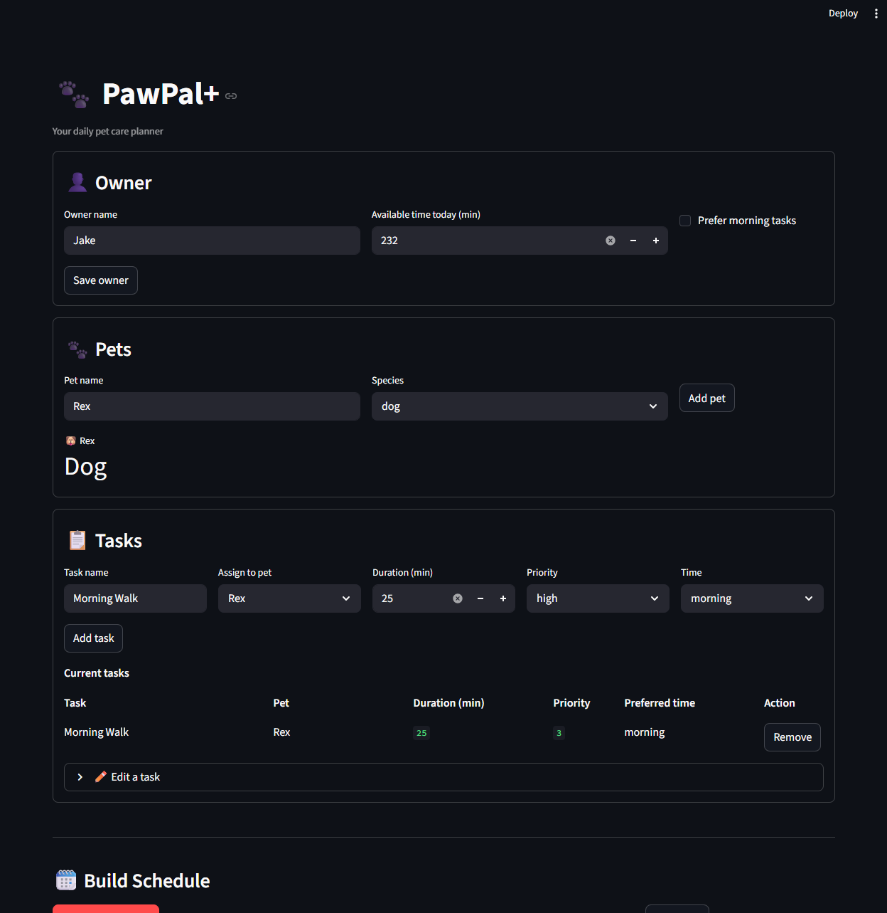
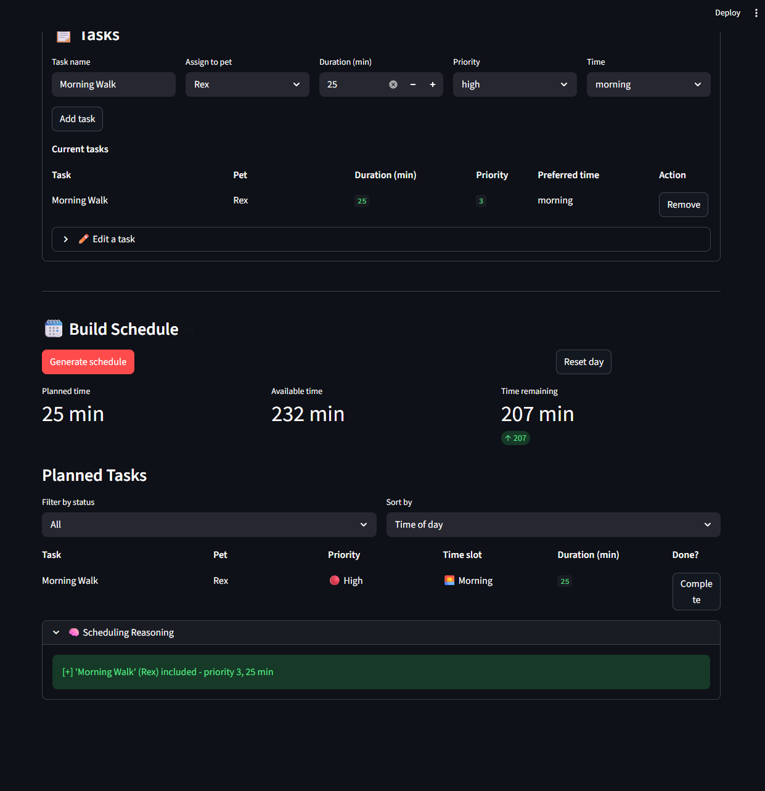

# PawPal+ (Module 2 Project)

You are building **PawPal+**, a Streamlit app that helps a pet owner plan care tasks for their pet.

## Scenario

A busy pet owner needs help staying consistent with pet care. They want an assistant that can:

- Track pet care tasks (walks, feeding, meds, enrichment, grooming, etc.)
- Consider constraints (time available, priority, owner preferences)
- Produce a daily plan and explain why it chose that plan

Your job is to design the system first (UML), then implement the logic in Python, then connect it to the Streamlit UI.

## What you will build

Your final app should:

- Let a user enter basic owner + pet info
- Let a user add/edit tasks (duration + priority at minimum)
- Generate a daily schedule/plan based on constraints and priorities
- Display the plan clearly (and ideally explain the reasoning)
- Include tests for the most important scheduling behaviors

## Getting started

### Setup

```bash
python -m venv .venv
source .venv/bin/activate  # Windows: .venv\Scripts\activate
pip install -r requirements.txt
```

### Suggested workflow

1. Read the scenario carefully and identify requirements and edge cases.
2. Draft a UML diagram (classes, attributes, methods, relationships).
3. Convert UML into Python class stubs (no logic yet).
4. Implement scheduling logic in small increments.
5. Add tests to verify key behaviors.
6. Connect your logic to the Streamlit UI in `app.py`.
7. Refine UML so it matches what you actually built.

## Testing PawPal+

### Run the tests

```bash
python -m pytest tests/test_pawpal.py -v
```

### What the tests cover

| Test | Behavior verified |
|------|------------------|
| `test_mark_complete_changes_status` | `mark_complete()` flips `is_completed` from `False` to `True` |
| `test_add_task_increases_pet_task_count` | Adding a task to a `Pet` grows its task list by one |
| `test_sort_by_time_returns_chronological_order` | `sort_by_time()` returns tasks in morning → afternoon → evening order regardless of insertion order |
| `test_daily_task_recurrence_schedules_next_day` | Completing a daily task auto-creates a new task due exactly one day later |
| `test_detect_conflicts_flags_duplicate_time_slots` | Two tasks sharing the same time slot produce a conflict warning for that slot |

### Confidence Level

**5 / 5 stars**

## ✨ Features

### Priority-Based Greedy Scheduling
Tasks are sorted by priority (high → medium → low) and greedily selected into the
daily plan until the owner's available time is exhausted. High-priority tasks are
always scheduled first, and lower-priority tasks are skipped if time runs out.

### Conflict Detection
After a schedule is generated, the app scans for tasks that share the same time
slot (morning / afternoon / evening). Any slot with two or more tasks triggers a
visible warning so the owner can adjust before the day begins.

### Chronological Sorting by Time of Day
The planned task list can be sorted by time slot (morning → afternoon → evening),
with unscheduled tasks appended last. Sorting maps slot labels to fixed anchor
times so the order is always consistent.

### Daily & Weekly Recurrence
Completing a `daily` or `weekly` task automatically creates the next occurrence
due exactly one day or seven days later and attaches it to the same pet. Tasks
marked `as needed` do not recur.

### Completion Filtering
The schedule view can be filtered to show all tasks, only pending tasks, or only
completed tasks, letting the owner focus on what still needs to be done.

### Multi-Pet Support
A single schedule can span multiple pets. Tasks are tagged with their pet's name
and displayed together in one unified plan, keeping a household with multiple
animals organised in one view.

### Inline Task Editing & Removal
Any task can be edited (name, duration, priority, time slot) or removed directly
from the UI without regenerating the whole schedule.

### Scheduling Reasoning Log
Every include/skip decision made during `generate()` is recorded in plain English
and shown in a collapsible panel, so the owner always knows *why* a task was left
out.

## 📸 Demo

<a href="app1.png" target="_blank">
  
</a>

<a href="app2.png" target="_blank">
  
</a>

